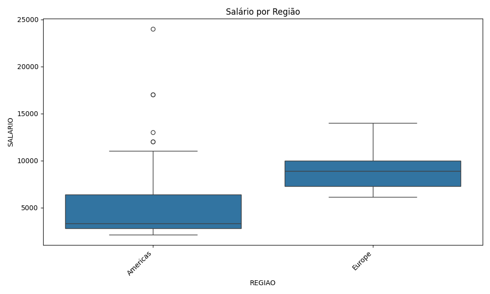

# PROJETO FINAL DE MÓDULO - VISUALIZAÇÃO DE DADOS - SCTEC E SENAI - ANÁLISE DE RH 

**Aluno:** LUIS EDUARDO NAPOLITANO
**Turma:** VISUALIZAÇÃO DE DADOS E BUSINESS INTELLIGNECE T2
**Professora:** NATALIA ARRUDA

## OBJETIVO DO TRABALHO
Analisar todos os dados de funcionários, cargos, departamentos e localização geográfica da
empresa (esquema HR), uma banco de dados específico para estudos, identificando padrões de remuneração por departamento e por
região usando SQL e Python.
Este banco de dados estpa dispnível para consultas no site freeSQL.

## TABELAS UTILIZADAS
- HR.EMPLOYEES — informações de dados dos funcionários e salários
- HR.DEPARTMENTS — informações dos departamentos da empresa
- HR.JOBS — informações de cargos
- HR.LOCATIONS — informações de endereços dos departamentos
- HR.COUNTRIES — informações dos países cadastrados
- HR.REGIONS — informações dde regiões geográficas

## RESUMO DAS CONSULTAS NO BANCO SQL E UTILIZAÇÃO DE QUERYs
- **Query 1:** utilizado a função para estudo de salário por departamento e cargo (EMPLOYEES + DEPARTMENTS + JOBS,
  com filtro `DEPARTMENT_ID IS NOT NULL`).
- **Query 2:** utilizado a função para estudo de funcionários por região, com cidade/estado/país (EMPLOYEES +
  DEPARTMENTS + LOCATIONS + COUNTRIES + REGIONS, com filtro `REGION_NAME IS NOT NULL`).

## ANÁLISE E TRATAMENTO DAS INFORMAÇÕES EM PYTHON
Os arquivos `sctec_len_query_01.csv` e `scte_len_query_02.csv` foram carregados com pandas e as
colunas renomeadas para português. Foram calculadas médias, medianas, mínimos e
máximos de salário — no geral, por departamento e por região — e gerados um
histograma da distribuição de salários e boxplots por departamento e por região.
Também foi feita uma verificação de outliers pelo método do intervalo interquartil (IQR).

## PRINCIPAIS RESULTADOS
- Salário médio geral: 6.456,75
- Salário mediano geral: 6.150,00 
- Salário mínimo: 2.100,00
- Salário máximo: 24.000,00
- Departamento com maior salário médio: 19.333,33 - Executive 
- Departamento com menor salário médio: 3.475,00 - Shipping
- Departamento com maior número de funcionários: Shipping com 45
- Região com maior concentração de funcionários: Americas com 70
- Quantidade de outliers encontrados: 1 com valor de 24.000,00

## COMO EXECUTAR O PROJETO 
1. Clone este repositório.
2. Instale as dependências: `pip install pandas matplotlib seaborn`.
3. Rode `python len_analise_dados.py`.
4. Os gráficos serão salvos na raiz do projeto.

## SUGESTÕES DE MELHORIAS
- Comparar salário real pago com a faixa MIN_SALARY/MAX_SALARY (salário mínimo e salário máximo) de cada cargo.
- Analisar relação entre tempo de casa (HIRE_DATE) e salário (SALARY).
- Cruzar o salário por cidade com índices de custo de vida (dado externo, não   presente no esquema HR), para avaliar se a remuneração é proporcionalmente justa entre localidades.

## GRAFICOS

